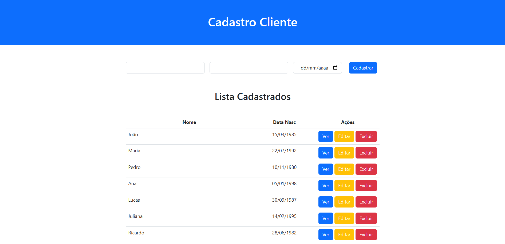
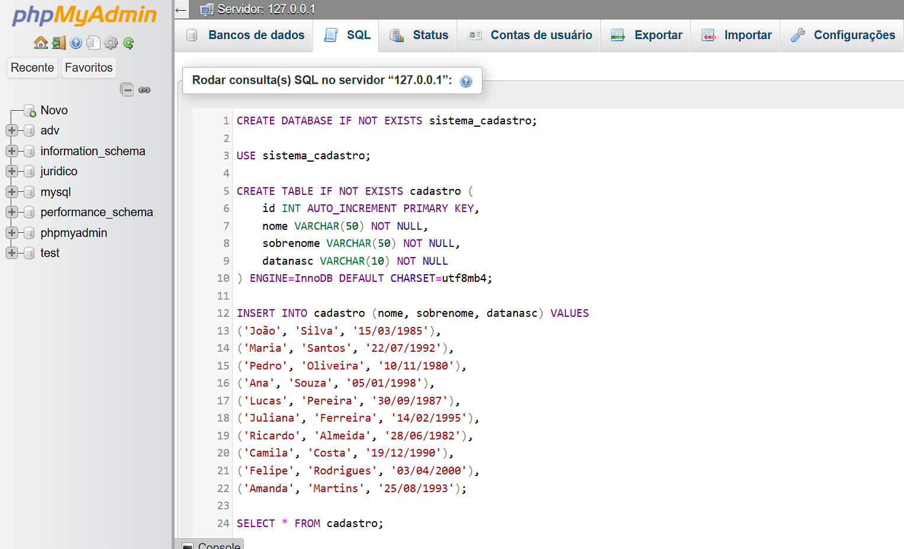

## Crud PHP PDO

<br />

<br />

### Banco mysql
```
CREATE DATABASE IF NOT EXISTS sistema_cadastro;
USE sistema_cadastro;

CREATE TABLE IF NOT EXISTS cadastro (
    id INT AUTO_INCREMENT PRIMARY KEY,
    nome VARCHAR(50) NOT NULL,
    sobrenome VARCHAR(50) NOT NULL,
    datanasc VARCHAR(10) NOT NULL
) ENGINE=InnoDB DEFAULT CHARSET=utf8mb4;
```

### seeds
```
use sistema_cadastro;

INSERT INTO cadastro (nome, sobrenome, datanasc) VALUES 
('João', 'Silva', '15/03/1985'),
('Maria', 'Santos', '22/07/1992'),
('Pedro', 'Oliveira', '10/11/1980'),
('Ana', 'Souza', '05/01/1998'),
('Lucas', 'Pereira', '30/09/1987'),
('Juliana', 'Ferreira', '14/02/1995'),
('Ricardo', 'Almeida', '28/06/1982'),
('Camila', 'Costa', '19/12/1990'),
('Felipe', 'Rodrigues', '03/04/2000'),
('Amanda', 'Martins', '25/08/1993');
```

### Preview


<br />

> * Ref.: Crud 31min
``` 
https://www.youtube.com/watch?v=9MJ6NYdRmqs
```

> * Re.: Login 25min
https://www.youtube.com/watch?v=WJQUxQgU_0w
```